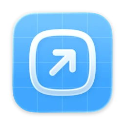

<h1 align="center">Pixzl Homebrew Tap</h1>

<p align="center">
  Pixzl apps for macOS — install them and keep them up to date right from your terminal.
</p>

<p align="center">
  <a href="https://www.pixzl.de">pixzl.de</a>&nbsp; ·&nbsp;
  <a href="https://brew.sh">Homebrew</a>
</p>

---

## Installation

Register the tap once:

```sh
brew tap pixzl/tap
```

Then install any app as a cask:

```sh
brew install --cask <app>
```

> **Shortcut:** You can also install directly, without tapping first —
> `brew install --cask pixzl/tap/<app>`

## Apps

<table>
  <tr>
    <td width="86" align="center" valign="middle">
      
    </td>
    <td valign="middle">
      <strong>DockPin</strong> &nbsp;<code>dockpin</code><br>
      Keeps the macOS Dock pinned to the screen you choose — in multi-monitor
      setups it no longer jumps between displays.<br>
      <sub><a href="https://www.pixzl.de/apps/dockpin">Product page</a> &nbsp;·&nbsp; macOS 13 (Ventura) or later</sub>
    </td>
  </tr>
  <tr>
    <td width="86" align="center" valign="middle">
      
    </td>
    <td valign="middle">
      <strong>Deploir</strong> &nbsp;<code>deploir</code><br>
      Monitors your Coolify deployments in real time — live status and build
      logs, with redeploy, restart and rollback right from the menu bar.<br>
      <sub><a href="https://www.pixzl.de/apps/deploir">Product page</a> &nbsp;·&nbsp; macOS 26 (Tahoe) or later</sub>
    </td>
  </tr>
</table>

## Maintenance

| Action     | Command                       |
| ---------- | ----------------------------- |
| Update     | `brew upgrade --cask <app>`   |
| Uninstall  | `brew uninstall --cask <app>` |
| Remove tap | `brew untap pixzl/tap`        |

---

<p align="center">
  <sub>
    © 2026 Pixzl · All rights reserved &nbsp;·&nbsp;
    <a href="https://www.pixzl.de/impressum">Imprint</a> &nbsp;·&nbsp;
    <a href="https://www.pixzl.de/datenschutz">Privacy</a>
  </sub>
</p>
